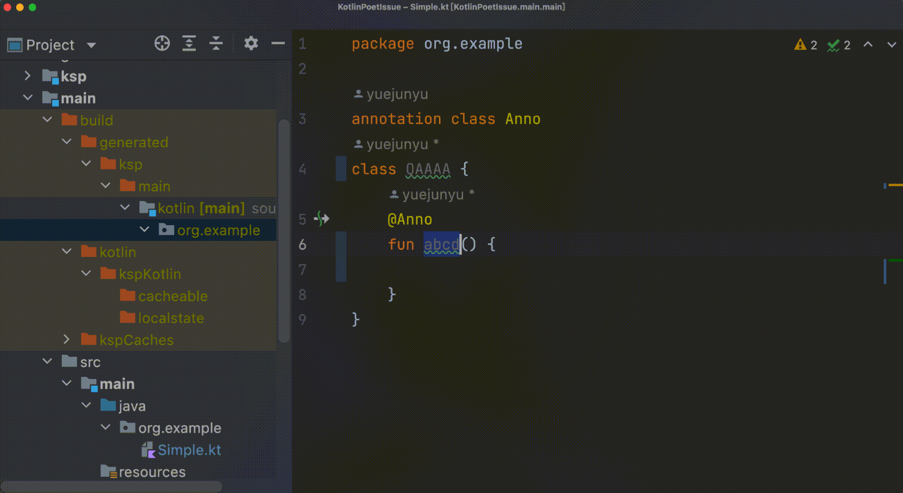

# KSP IDE Plugin

Skip the gradle ksp task and use the IDE plug-in to quickly process the annotations!



## Quickstart

### 1. Add Dependencies

First, make sure you can write an idea plugin using gradle, if you can't,
follow [gradle-intellij-plugin](https://github.com/JetBrains/gradle-intellij-plugin) to build an idea plugin:

maven
artifact: [](https://search.maven.org/artifact/io.github.zsqw123/ksp-ide)

```kotlin
repositories {
    mavenCentral()
}
dependencies {
    implementation("io.github.zsqw123:ksp-ide:$version")
}
```

### 2. Implement Annotation Processor

In the simplest case, we would like you to use it with [kotlinpoet](https://github.com/square/kotlinpoet) and just need
to extend `PoetAnnotationProcessor`, and implement the `readAnnotated`:

```kotlin
class FakeAnnotationProcessor : PoetAnnotationProcessor() {
    // your annotation class full qualified name
    override val annotationFqn: String = FAKE_FQN
    override fun readAnnotated(annotated: KtDeclaration): FileSpec? {
        // read annotated to generate a kotlinpoet FileSpec
    }
}
```

### 3. Attach Line Marker

Just override the `icon`, and that's it!

```kotlin
class FakeMarker : AnnotationLineMaker(FakeAnnotationProcessor()) {
    override fun icon(): Icon = KotlinIcons.SUSPEND_CALL
}
```

Then register to your plugin.xml

```xml
<idea-plugin xmlns:xi="http://www.w3.org/2001/XInclude">
    <xi:include href="/META-INF/ksp-ide.xml"/>
    <extensions defaultExtensionNs="com.intellij">
        <codeInsight.lineMarkerProvider language="UAST" implementationClass="zsu.ksp.ide.sample.FakeMarker"/>
    </extensions>
</idea-plugin>
```

### 4. Config KSP Path

Add the following to the `gradle.properties` file in the root directory of the corresponding module

```properties
ksp_generate_dir=build/generated/ksp/main/kotlin
```

So we're all done, simply and elegantly.

## LICENSE

[Apache License, Version 2.0](https://www.apache.org/licenses/LICENSE-2.0.txt)